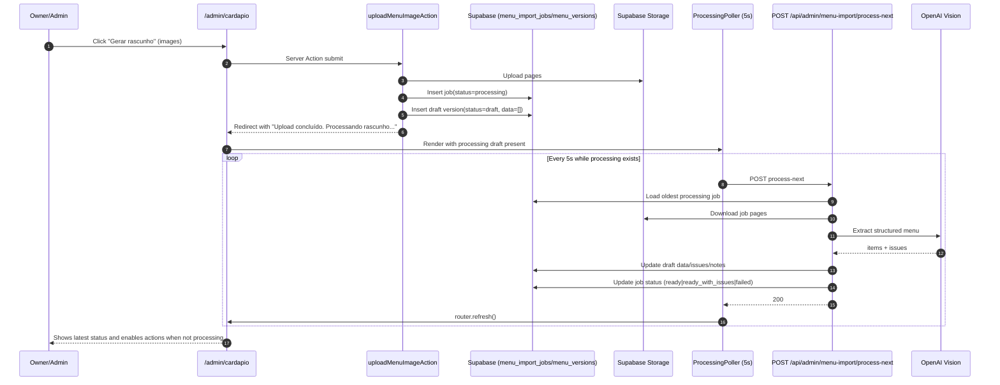

# Menu Generation from Owner Image — Feature Documentation

Summary for the next engineer: what was built, where it lives, and how the async background update loop works.

**Brief:** [docs/briefs/menu-generation-from-owner-image.md](briefs/menu-generation-from-owner-image.md)

---

## What Was Delivered

- **Admin upload flow (`/admin/cardapio`):** authenticated owner uploads `1..5` images (JPG/PNG/WEBP).
- **Draft-first workflow:** upload creates a `menu_import_jobs` row + `menu_versions` draft; no auto-publish.
- **Background extraction:** image-to-menu extraction runs outside the upload request via polling-triggered processing endpoint.
- **Live status UI:** recent versions show `Processando/Pronto/Falhou` and auto-refresh every `5s` while processing exists.
- **Action gating:** `Publicar/Descartar` buttons are hidden while a draft is `processing`.
- **DB source-of-truth:** published `menu_versions` (status=`active`) powers runtime menu; fallback to `data/menu.json` remains.
- **Owner-only control:** menu import access is restricted by e-mail allowlist (`MENU_IMPORT_ALLOWED_EMAILS`, default `vinidroid@gmail.com`).

---

## Where It Lives

| Area | Path / component |
|------|-------------------|
| Admin page (server UI) | `app/admin/cardapio/page.tsx` |
| Upload form (loading state) | `app/admin/cardapio/upload-form.tsx` |
| Processing poll trigger | `app/admin/cardapio/processing-poller.tsx` |
| Server actions (upload/publish/discard) | `app/admin/cardapio/actions.ts` |
| Background processor API | `app/api/admin/menu-import/process-next/route.ts` |
| Extractor (OpenAI vision + normalization) | `lib/menu-import/extract-openai.ts` |
| Access guard | `lib/menu-import/access.ts` |
| Runtime menu loader | `lib/menu-runtime.ts` |
| DB migration (base tables) | `supabase/migrations/20260302150000_add_menu_import_tables.sql` |
| DB migration (multi-page columns) | `supabase/migrations/20260304103000_add_menu_import_multi_page_columns.sql` |

---

## Background Updates (How It Works)

The upload request is intentionally short and does not wait for OCR/vision extraction.  
Processing is advanced in the background by a client-side poller that calls an authenticated processing endpoint.

### Sequence Diagram

### State Rules

- `menu_import_jobs.status` drives processing lifecycle:
  - `processing -> ready | ready_with_issues | failed -> published | discarded`
- Draft actions:
  - while `processing`: hide `Publicar` and `Descartar`
  - when not processing and version is `draft`: show actions
- Failure behavior:
  - active menu remains unchanged
  - draft notes/issues contain failure details

---

## Access Control

- Protected by authentication (`auth.getUser()`), plus allowlist:
  - `canUseMenuImport(email)` in `lib/menu-import/access.ts`
- Applied on:
  - page render (`/admin/cardapio`)
  - server actions (`upload/publish/discard`)
  - processing endpoint (`/api/admin/menu-import/process-next`)
- Header link visibility (`/admin` layout) follows same rule.

---

## Configuration

- `OPENAI_API_KEY`
- `OPENAI_MENU_VISION_MODEL` (ex: `gpt-4.1`, `gpt-5.2` if available)
- `OPENAI_MENU_VISION_TIMEOUT_MS` (recommended `90000..120000` for multi-page imports)
- `MENU_IMPORT_BUCKET` (private bucket)
- `MENU_IMPORT_ALLOWED_EMAILS` (comma-separated owner e-mails; default `vinidroid@gmail.com`)

---

## Known Gaps / Deferred

- Polling trigger is best-effort and browser-driven; no dedicated server queue/worker yet.
- No progressive per-page extraction status; status is job-level.
- No automatic cleanup of old uploaded source images.

---

## Troubleshooting

### Draft stuck in `Processando`

- Confirm the browser tab for `/admin/cardapio` is open (poller runs client-side every 5s).
- Check network calls for `POST /api/admin/menu-import/process-next`:
  - if `403`, your user e-mail is outside `MENU_IMPORT_ALLOWED_EMAILS`
  - if `401`, auth session expired
- Check DB row:
  - `menu_import_jobs.status` should move from `processing` to `ready | ready_with_issues | failed`
- If needed, refresh the page manually to force a new render cycle.

### Extraction timeout

- Symptom in logs: `Timeout na extração (...)`.
- Increase `OPENAI_MENU_VISION_TIMEOUT_MS` (`90000` to `120000` recommended for multi-page).
- Use a stronger model when available and reduce image size/quality when possible.

### `Publicar`/`Descartar` buttons not visible

- Buttons are intentionally hidden while:
  - version is `draft` and import job is `processing`
- Buttons appear when job status becomes:
  - `ready`
  - `ready_with_issues`
  - `failed` (for discard flow)

### `Rascunhos` list appears stale

- Page is dynamic and should refresh from poller, but verify:
  - `/admin/cardapio` is the active tab
  - processing endpoint returns `200`
- Hard refresh once if the browser cached UI state after a deploy.

### Non-owner cannot access menu import

- Expected behavior.
- Access is gated by `MENU_IMPORT_ALLOWED_EMAILS`.
- If access should be granted, add the e-mail to that env var and redeploy/restart.
