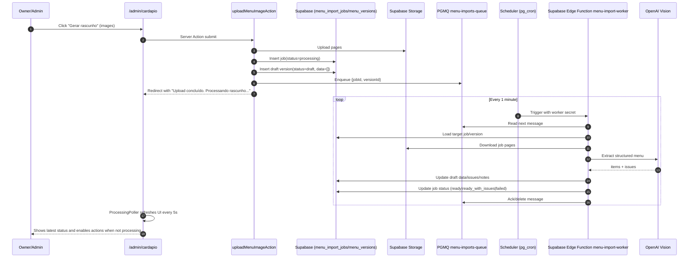
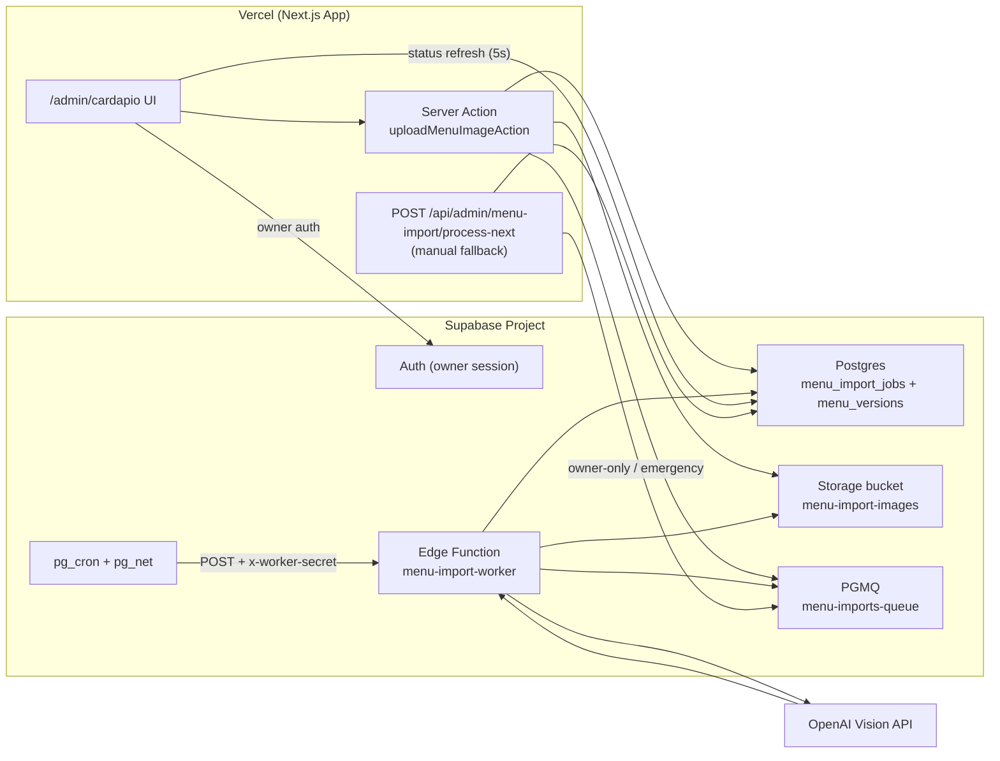

# Menu Generation from Owner Image — Feature Documentation

Summary for the next engineer: what was built, where it lives, and how the async background update loop works.

**Brief:** [docs/briefs/menu-generation-from-owner-image.md](briefs/menu-generation-from-owner-image.md)

---

## What Was Delivered

- **Admin upload flow (`/admin/cardapio`):** authenticated owner uploads `1..5` images (JPG/PNG/WEBP).
- **Draft-first workflow:** upload creates a `menu_import_jobs` row + `menu_versions` draft; no auto-publish.
- **Background extraction (server-side):** image-to-menu extraction runs outside upload request via queue worker (`pgmq` + scheduled worker trigger).
- **Live status UI:** recent versions show `Processando/Pronto/Falhou` and auto-refresh every `5s` while processing exists.
- **Action gating:** `Publicar/Descartar` buttons are hidden while a draft is `processing`.
- **DB source-of-truth:** published `menu_versions` (status=`active`) powers runtime menu; fallback to `data/menu.json` remains.
- **Owner-only control:** menu import access is restricted by e-mail allowlist (`MENU_IMPORT_ALLOWED_EMAILS`, default `vinidroid@gmail.com`).

---

## Where It Lives

| Area | Path / component |
|------|-------------------|
| Admin page (server UI) | `app/admin/cardapio/page.tsx` |
| Upload form (loading state) | `app/admin/cardapio/upload-form.tsx` |
| Processing poll trigger | `app/admin/cardapio/processing-poller.tsx` |
| Server actions (upload/publish/discard) | `app/admin/cardapio/actions.ts` |
| Vercel fallback processor API (manual/owner-only) | `app/api/admin/menu-import/process-next/route.ts` |
| Queue helpers | `lib/menu-import/queue.ts` |
| Shared processor logic | `lib/menu-import/processor.ts` |
| Supabase primary worker | `supabase/functions/menu-import-worker/index.ts` |
| Extractor (OpenAI vision + normalization) | `lib/menu-import/extract-openai.ts` |
| Access guard | `lib/menu-import/access.ts` |
| Runtime menu loader | `lib/menu-runtime.ts` |
| DB migration (base tables) | `supabase/migrations/20260302150000_add_menu_import_tables.sql` |
| DB migration (multi-page columns) | `supabase/migrations/20260304103000_add_menu_import_multi_page_columns.sql` |
| DB migration (queue RPC wrappers) | `supabase/migrations/20260304143000_add_menu_import_queue_rpc.sql` |

---

## Background Updates (How It Works)

The upload request is intentionally short and does not wait for OCR/vision extraction.  
Processing is advanced server-side from queue messages (Supabase scheduler/worker path), independent of browser tabs.

### Sequence Diagram

### Environment Integration Diagram (Vercel + Supabase)

### State Rules

- `menu_import_jobs.status` drives processing lifecycle:
  - `processing -> ready | ready_with_issues | failed -> published | discarded`
- Draft actions:
  - while `processing`: hide `Publicar` and `Descartar`
  - when not processing and version is `draft`: show actions
- Failure behavior:
  - active menu remains unchanged
  - draft notes/issues contain failure details

---

## Access Control

- Protected by authentication (`auth.getUser()`), plus allowlist:
  - `canUseMenuImport(email)` in `lib/menu-import/access.ts`
- Applied on:
  - page render (`/admin/cardapio`)
  - server actions (`upload/publish/discard`)
  - fallback processing endpoint (`/api/admin/menu-import/process-next`)
  - primary Supabase worker (`x-worker-secret` / secret match)
- Header link visibility (`/admin` layout) follows same rule.

---

## Configuration

- `OPENAI_API_KEY`
- `OPENAI_MENU_VISION_MODEL` (ex: `gpt-4.1`, `gpt-5.2` if available)
- `OPENAI_MENU_VISION_TIMEOUT_MS` (recommended `90000..120000` for multi-page imports)
- `MENU_IMPORT_BUCKET` (private bucket)
- `MENU_IMPORT_ALLOWED_EMAILS` (comma-separated owner e-mails; default `vinidroid@gmail.com`)
- `MENU_IMPORT_WORKER_SECRET` (required for scheduler/worker auth)

---

## Deployment Runbook (Queue Worker)

### 1) Apply DB migrations

Apply pending Supabase migrations, including queue RPC wrappers:

- `supabase/migrations/20260304143000_add_menu_import_queue_rpc.sql`

### 2) Set required secrets/env

Set these values in the right runtime:

- Supabase Edge Function secrets:
  - `SUPABASE_URL`
  - `SUPABASE_SERVICE_ROLE_KEY`
  - `OPENAI_API_KEY`
  - `OPENAI_MENU_VISION_MODEL`
  - `OPENAI_MENU_VISION_TIMEOUT_MS`
  - `MENU_IMPORT_BUCKET`
  - `MENU_IMPORT_WORKER_SECRET`
- App runtime (Next.js/Vercel):
  - `MENU_IMPORT_ALLOWED_EMAILS`
  - `MENU_IMPORT_WORKER_SECRET` (only if using `/api/admin/menu-import/process-next` manual fallback)

### 3) Deploy worker function

Deploy `supabase/functions/menu-import-worker` to the target Supabase project.

### 4) Configure scheduler

Configure `pg_cron` + `pg_net` to invoke the worker on interval (recommended: every 1 minute) with:

- HTTP method: `POST`
- Header: `x-worker-secret: <MENU_IMPORT_WORKER_SECRET>`

### 5) Smoke test

Upload a menu image from `/admin/cardapio` and verify:

- queue receives message
- worker consumes message
- `menu_import_jobs.status` transitions from `processing` to `ready | ready_with_issues | failed`
- recent drafts list reflects updated status

---

## Rollback Plan

- Disable scheduler/cron first to stop new worker runs.
- Keep uploaded drafts; they remain non-active until publish.
- Re-enable manual fallback processing temporarily via `/api/admin/menu-import/process-next` (owner-only).
- If needed, redeploy previous app version while keeping DB rows intact.
- Do not delete queue messages blindly; inspect and drain intentionally after rollback decision.

---

## Known Gaps / Deferred

- Queue worker retry policy currently fixed (`max 5 attempts`, `60s` visibility/retry window).
- No progressive per-page extraction status; status is job-level.
- No automatic cleanup of old uploaded source images.

---

## Troubleshooting

### Draft stuck in `Processando`

- Check scheduler/worker execution logs first (Supabase cron + edge function).
- Confirm worker auth secret matches:
  - scheduler header / secret
  - `MENU_IMPORT_WORKER_SECRET` in function env
- Validate queue state:
  - message exists in `menu-imports-queue`
  - retries/attempt count not exhausted unexpectedly
- Check DB row:
  - `menu_import_jobs.status` should move from `processing` to `ready | ready_with_issues | failed`
- Use `/api/admin/menu-import/process-next` only as manual fallback during rollout.

### Extraction timeout

- Symptom in logs: `Timeout na extração (...)`.
- Increase `OPENAI_MENU_VISION_TIMEOUT_MS` (`90000` to `120000` recommended for multi-page).
- Use a stronger model when available and reduce image size/quality when possible.

### `Publicar`/`Descartar` buttons not visible

- Buttons are intentionally hidden while:
  - version is `draft` and import job is `processing`
- Buttons appear when job status becomes:
  - `ready`
  - `ready_with_issues`
  - `failed` (for discard flow)

### `Rascunhos` list appears stale

- Page is dynamic and refreshes from UI poller, but verify:
  - `/admin/cardapio` is active for auto-refresh
  - worker is actually progressing queue messages server-side
- Hard refresh once if the browser cached UI state after a deploy.

### Non-owner cannot access menu import

- Expected behavior.
- Access is gated by `MENU_IMPORT_ALLOWED_EMAILS`.
- If access should be granted, add the e-mail to that env var and redeploy/restart.
